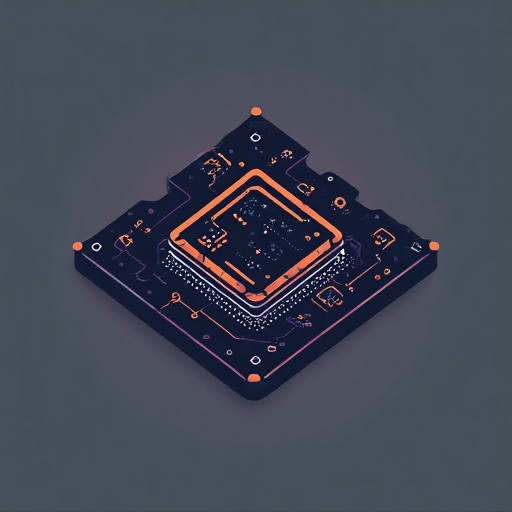

<a id="readme-top"></a>

<!-- PROJECT LOGO -->
<br />
<div align="center">
  <a href="https://github.com/Petar-Yordanov/micros">
    
  </a>

  <h3 align="center">MicrOS</h3>

  <p align="center">
    MicrOS is a Micro Operating System implemented for 64-bit CPUs with a monolithic architecture. 
  </p>
</div>

<!-- TABLE OF CONTENTS -->
<details>
  <summary>Table of Contents</summary>
  <ol>
    <li>
      <a href="#about-the-project">About The Project</a>
      <ul>
        <li><a href="#built-with">Built With</a></li>
      </ul>
    </li>
    <li>
      <a href="#getting-started">Getting Started</a>
      <ul>
        <li><a href="#prerequisites">Prerequisites</a></li>
        <li><a href="#installation">Installation</a></li>
      </ul>
    </li>
    <li><a href="#usage">Usage</a></li>
    <li><a href="#roadmap">Roadmap</a></li>
    <li><a href="#license">License</a></li>
  </ol>
</details>

<!-- ABOUT THE PROJECT -->
## About The Project

MicrOS is a 64-bit Rust hobby kernel booted via Limine, featuring x86_64 descriptor setup (GDT/IDT/TSS), ISRs/IRQs with APIC timers (legacy PIC disabled) and RTC time, a full memory stack (frames, paging, VM arena, heap), serial-based debugging, PCI + virtio devices (blk and input), a VFS + FAT32/ext2 filesystem, and a preemptive scheduler with kernel threads and sleep. Userspace is still WIP (syscalls, ELF loader, shell, basic apps, device files, GUI).

<div align="center">

[](https://github.com/Petar-Yordanov/micros/actions/workflows/build.yml)

</div>

<p align="right">(<a href="#readme-top">back to top</a>)</p>

### Built With

* [![Rust][rust-badge]][rust-url]
* [![Linux][linux-badge]][linux-url]
* [![GitHub Actions][gha-badge]][gha-url]
* [![QEMU][qemu-badge]][qemu-url]
* [![Make][make-badge]][make-url]

<!-- Badges -->
[rust-badge]: https://img.shields.io/badge/Rust-000000?style=for-the-badge&logo=rust&logoColor=white
[rust-url]: https://www.rust-lang.org/

[linux-badge]: https://img.shields.io/badge/Linux-FCC624?style=for-the-badge&logo=linux&logoColor=black
[linux-url]: https://www.kernel.org/

[gha-badge]: https://img.shields.io/badge/GitHub%20Actions-2088FF?style=for-the-badge&logo=githubactions&logoColor=white
[gha-url]: https://github.com/features/actions

[qemu-badge]: https://img.shields.io/badge/QEMU-FF6600?style=for-the-badge&logo=qemu&logoColor=white
[qemu-url]: https://www.qemu.org/

[make-badge]: https://img.shields.io/badge/Make-000000?style=for-the-badge&logo=gnu&logoColor=white
[make-url]: https://www.gnu.org/software/make/

<p align="right">(<a href="#readme-top">back to top</a>)</p>


<!-- GETTING STARTED -->
## Getting Started

MicrOS64 builds an ISO using Limine and runs under QEMU. It uses virtio-pci, virtio-blk and virtio-input infrastructure for devices.

### Prerequisites

- Linux host (Ubuntu 24.04 / Fedora 41 tested)
- Rust **nightly** + `rust-src`
- Target: `x86_64-unknown-none`
- Tooling: `make`, `clang`, `lld`, `nasm`
- ISO + disk tooling: `xorriso`, `qemu-img`, `mtools`, `dosfstools`, `e2fsprogs`
- QEMU: `qemu-system-x86_64`

* Essentials setup on Ubuntu/Debian
  ```sh
    sudo apt-get update
    sudo apt-get install -y \
    xorriso \
    qemu-utils \
    mtools \
    dosfstools \
    e2fsprogs \
    make \
    git \
    curl \
    ca-certificates \
    gcc \
    clang \
    lld \
    nasm
  ```

* Install Rust
  ```sh
    curl --proto '=https' --tlsv1.2 -sSf https://sh.rustup.rs | sh
    source "$HOME/.cargo/env"

    rustup toolchain install nightly
    rustup component add rust-src --toolchain nightly
    rustup target add x86_64-unknown-none --toolchain nightly
  ```

### Installation

1. Clone the repo
   ```sh
   git clone git@github.com:Petar-Yordanov/micros.git
   ```
2. Build ISO
   ```sh
   make
   ```
3. Create, format and populate the disk
   ```sh
    # FAT32
    make create-disk FS=fat32

    # ext2
    make create-disk FS=ext2
   ```
4. Populate disk
  ```
  # FAT32
  make setup-disk FS=fat32

  # ext2
  make setup-disk  FS=ext2
  ```

<p align="right">(<a href="#readme-top">back to top</a>)</p>

<!-- USAGE EXAMPLES -->
## Usage

Run under QEMU:
```sh
# FAT32
make run FS=fat32

# ext2
make run FS=ext2
```

<p align="right">(<a href="#readme-top">back to top</a>)</p>

## Roadmap

### Kernel

- [x] **CPU setup / Descriptors**
  - [x] GDT
  - [x] IDT
  - [x] TSS

- [x] **Interrupts**
  - [x] ISRs (exceptions/faults)
  - [x] IRQ handling

- [x] **Timers / Timekeeping**
  - [x] Disable legacy PIC (8259)
  - [x] Local APIC + timer
  - [x] RTC (CMOS time)

- [x] **Memory**
  - [x] Physical frames allocator
  - [x] Pages + paging (virtual memory)
  - [x] Virtual memory arena (VM arena / scratch mappings)
  - [x] Kernel heap

- [x] **Output / Debugging**
  - [x] Serial logging
  - [x] QEMU logs workflow

- [x] **Devices**
  - [x] PCI
  - [x] Virtio-blk
  - [x] Virtio-input
  - [x] Virtio-net

- [x] **Storage / Filesystems**
  - [x] VFS layer
  - [x] FAT32 filesystem
  - [x] Ext2 filesystem

- [x] **Scheduling**
  - [x] Preemptive scheduler
  - [x] Kernel threads
  - [x] Sleep / timers integration

- [x] **Graphics**
  - [x] Framebuffer info / mapping
  - [x] Basic pixel drawing + text overlay (debug GUI)

---

### Userspace

- [x] **Bootstrap / Execution**
  - [x] `/bin/init.elf`
  - [x] Root mount + `exec("/bin/wm.elf")`
  - [x] User ELF loading
  - [x] Userspace runtime (`rlibc`, ABI, heap, panic handlers)

- [x] **Syscall layer**
  - [x] Logging
  - [x] Framebuffer
  - [x] Input
  - [x] Yield / exec / process
  - [x] VFS
  - [x] Time/date syscall support
  - [x] Networking

- [x] **Apps**
  - [x] File explorer
  - [x] Task manager
  - [x] Clock
  - [x] Notepad
  - [x] Browser (HTTP Only)

- [ ] **Networking**
  - [x] Virtio-net device bring-up
  - [x] Ethernet frame send/receive
  - [x] ARP request/reply handling
  - [x] IPv4 packet parsing/building
  - [x] ICMPv4 ping / echo handling
  - [x] DNS lookup
  - [x] TCP connect / handshake
  - [x] TCP send/receive byte-stream syscalls
  - [x] HTTP GET over TCP
  - [ ] TCP close / teardown cleanup

- [ ] **GUI stack**
  - [x] Single-process UI model
  - [x] WM + `libui` + apps in one address space
  - [x] Full redraw framebuffer renderer
  - [x] Userspace input parsing / dispatch
  - [x] Basic windows and embedded apps
  - [x] Taskbar / start menu / app launching
    - [x] Shutdown mechanism
    - [x] Apps dropdown
  - [x] Window drag / close / minimize / maximize
  - [x] Desktop icons
  - [x] Placeholder clock / date
  - [x] `.ico` icon loading
  - [x] ICO decode support (32-bit BGRA, 24-bit + AND mask)
  - [x] Widgets
    - [x] Windows
    - [x] Titlebars
    - [x] Buttons
    - [x] Labels / text
    - [x] Desktop icons
    - [x] Taskbar / start menu style clickable items
    - [x] Mouse hover / pressed states
    - [x] Event handling
    - [x] Icon rendering
    - [x] Panels / containers
    - [x] List view
    - [x] Table view
    - [x] Tree view
    - [x] Text fields
    - [x] Text area / console view
    - [x] Scrolling
    - [x] Menu items / submenu actions
  - [x] Better styling
  - [ ] Separate app processes
  - [ ] Multi-process GUI architecture (comm via IPC)

<p align="right">(<a href="#readme-top">back to top</a>)</p>

<!-- LICENSE -->
## License

Distributed under the MIT License. See `LICENSE.md` for details.

<p align="right">(<a href="#readme-top">back to top</a>)</p>
